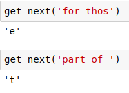

# Recurrent
This repository contains different architectures of language modelling models using RNNs/GRU/LSTMs .

# Transfer Learning in Langage Modelling (Classification)
Implementation of [Universal Language Model Fine-tuning for Text Classification](https://arxiv.org/abs/1801.06146) (Fast.ai)

Dataset Required - Imdb
```
$ python UMLift.py
```
There are some other dependencies and downloads of files which are to be taken care of while running this, see the file for more info

## Requirements:
- Pytorch
- Numpy
- Python 3.x
- Fast.ai lib

## Acquire the Repo
```shell
$ git clone https://github.com/prajjwal1/language-modelling
```

## Predictions


## Contributions
Contributions are always welcome in the form of pull requests with explanatory comments.
