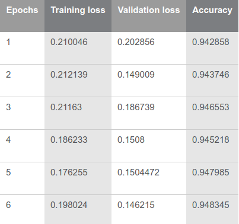

# Language Modelling

## Transfer Learning in Langage Modelling (Classification)
Implementation of [Universal Language Model Fine-tuning for Text Classification](https://arxiv.org/abs/1801.06146) (Fast.ai)

I've written a detailed blog on how ULMFit works and what problems are being solved on Intel IDZ, link [here](https://github.com/prajjwal1/language-modelling.git)

### Dataset 
- Imdb
I'm yet to try with other datasets
```
$ python UMLift.py
```
There are some other dependencies and downloads of files which are to be taken care of while running this, see the file for more info

### Requirements:
- Pytorch
- Numpy
- Python 3.x
- Fast.ai lib

### Acquire the Repo
```shell
$ git clone https://github.com/prajjwal1/language-modelling
```
### Architecture of ULMFit (builds on AWD-LSTM)
#### Regularizing and optimizing LSTM Language Models (https://arxiv.org/abs/1708.02182)


### Results


Validation error rate (from the paper)


### Contributions
Contributions are always welcome in the form of pull requests with explanatory comments.
